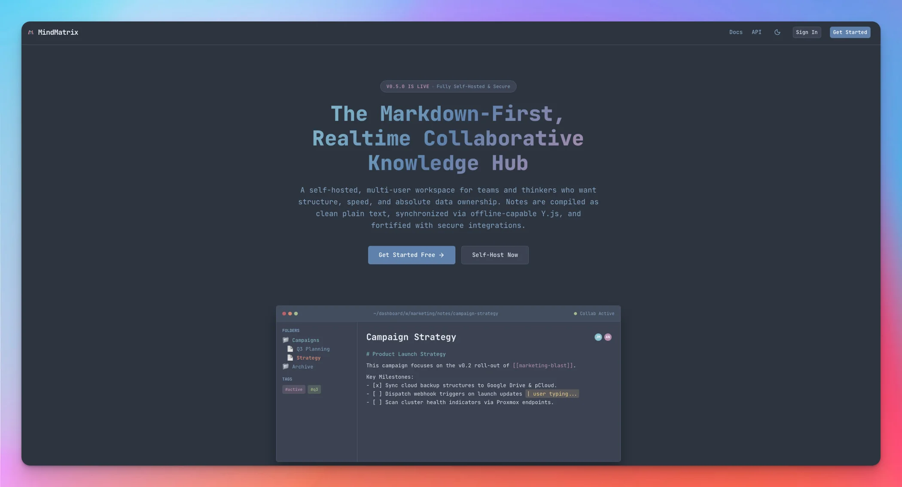
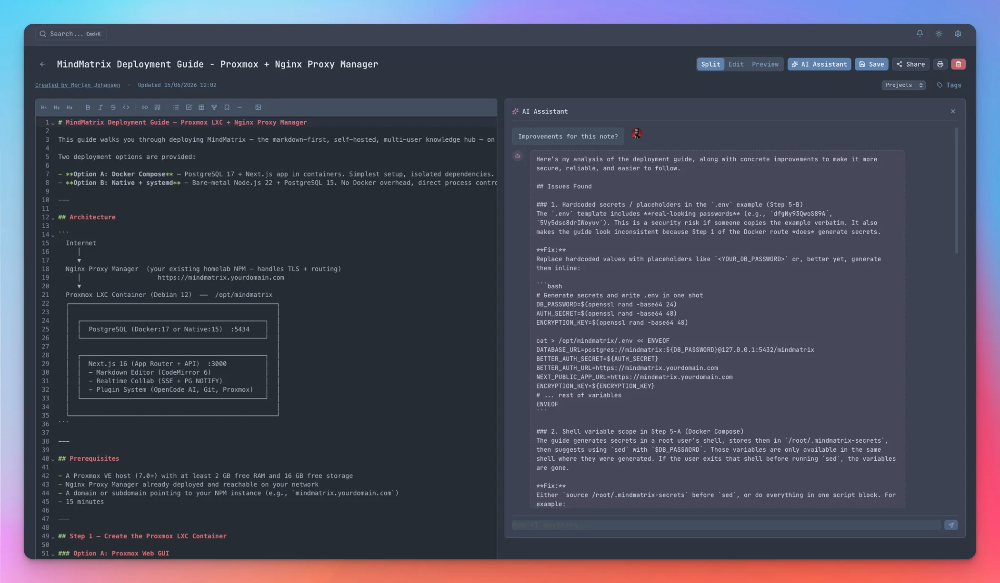
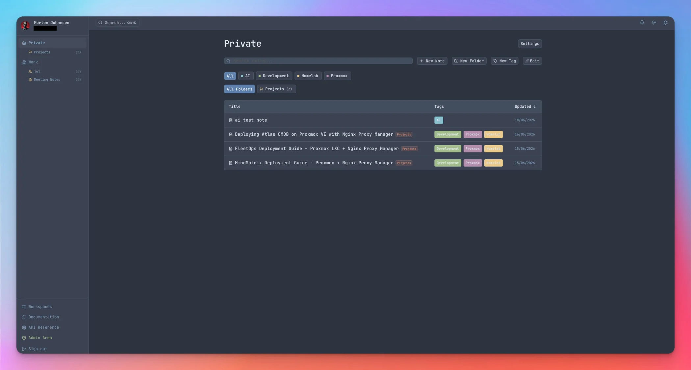
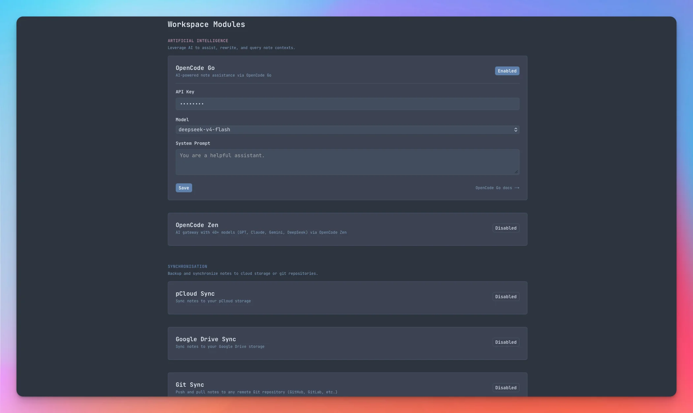
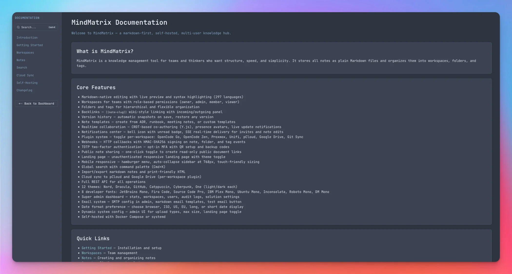
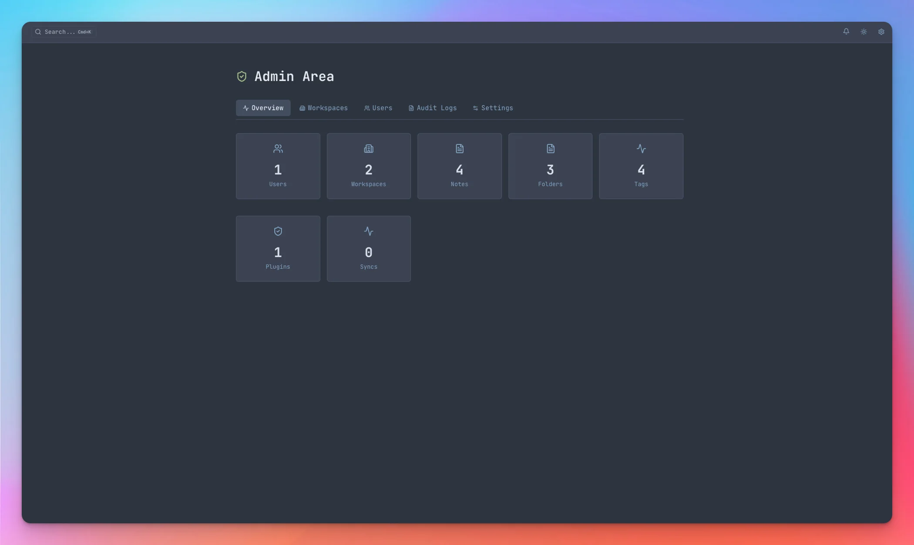

# MindMatrix

<p align="center">
  
  
  
  
</p>

<p align="center">
  <strong>Markdown-first, self-hosted, multi-user knowledge hub for teams and thinkers.</strong>
</p>

---

## Application Showcase

<p align="center">
  <table>
    <tr>
      <!-- Column 1 -->
      <td width="33%" align="center" valign="top">
        <h4>1. Public Landing Page</h4>
        <p><em>The Gateway to Your Hub</em></p>
        
        <br/><br/>
        <p align="left" style="font-size: 0.85em; color: gray;">
          An elegant, responsive landing page featuring an interactive split-view workspace mockup, script-copying quick helpers, and a dynamic Theme Preset Quick Switcher.
        </p>
      </td>
      <!-- Column 2 -->
      <td width="33%" align="center" valign="top">
        <h4>2. 2-Column AI Workspace</h4>
        <p><em>Context-Aware AI Prompting</em></p>
        
        <br/><br/>
        <p align="left" style="font-size: 0.85em; color: gray;">
          A premium split-screen layout that lets you edit CodeMirror Markdown on the left while holding context-aware AI conversations with active profile avatars and 3-attempt exponential backoff on the right.
        </p>
      </td>
      <!-- Column 3 -->
      <td width="33%" align="center" valign="top">
        <h4>3. Workspace Dashboard</h4>
        <p><em>Centralized Knowledge Control</em></p>
        
        <br/><br/>
        <p align="left" style="font-size: 0.85em; color: gray;">
          A robust, multi-tenant workspace dashboard showing dynamic color-coded tags, sidebar folder filtering, realtime member presence, and responsive notes table column-sorting.
        </p>
      </td>
    </tr>
    <tr>
      <!-- Column 4 -->
      <td width="33%" align="center" valign="top">
        <h4>4. Categorized Plugins</h4>
        <p><em>Modular Extension Hub</em></p>
        
        <br/><br/>
        <p align="left" style="font-size: 0.85em; color: gray;">
          A beautiful workspace settings panel organized into categorized grids (AI Assistants, Sync tools, and Infrastructure Scanners) secured with AES-256-GCM credentials encryption.
        </p>
      </td>
      <!-- Column 5 -->
      <td width="33%" align="center" valign="top">
        <h4>5. In-App Documentation</h4>
        <p><em>Comprehensive Guides & APIs</em></p>
        
        <br/><br/>
        <p align="left" style="font-size: 0.85em; color: gray;">
          Interactive in-app documentation featuring quick global search, language-specific integration snippets (cURL, Python, JS), and your new dedicated v0.5.0 release history log.
        </p>
      </td>
      <!-- Column 6 -->
      <td width="33%" align="center" valign="top">
        <h4>6. Super Admin Panel</h4>
        <p><em>Global Instance Orchestration</em></p>
        
        <br/><br/>
        <p align="left" style="font-size: 0.85em; color: gray;">
          An advanced gated control console mapping system-wide usage statistics, global workspaces, dynamic upload configurations, SMTP setups, and searchable operational audit logging.
        </p>
      </td>
    </tr>
  </table>
</p>

---

## Realtime Architecture (SSE + PostgreSQL NOTIFY)

MindMatrix utilizes a highly optimized, state-of-the-art realtime architecture built entirely with native web primitives. Instead of relying on heavy, resource-intensive WebSockets or external message brokers, we utilize Server-Sent Events (SSE) coupled with PostgreSQL's high-speed, built-in asynchronous channel subscription (`LISTEN`/`NOTIFY`):

```text
  [ Browser (Editor) ]   <--- (SSE event-stream) ---   [ Next.js API Route ]
            │                                                    ▲
      (Heartbeat/Save)                                           │ (Event Bus LISTEN)
            ▼                                                    │
[ PATCH /api/notes/[id] ] --- (Save to DB) ---> [ Postgres NOTIFY 'note:<id>' ]
```

This ensures zero-overhead, sub-millisecond collaboration, viewing-presence heartbeats, and live notification pushes across the entire system.

---

## Quick Start

### Docker Compose (Recommended)

```bash
git clone git@github.com:mojoaar/mindmatrix.git
cd mindmatrix
cp .env.example .env
# Generate a secure auth secret: openssl rand -base64 48
# Edit .env with your secrets
docker compose -f deploy/docker-compose.yml up -d
```

The app will be available at http://localhost:3000

### Node.js / systemd

```bash
git clone git@github.com:mojoaar/mindmatrix.git /opt/mindmatrix
cd /opt/mindmatrix
cp .env.example .env
# Edit .env with your database credentials and secrets
npm ci
npm run build
npm run db:push
npm run start
```

See `deploy/mindmatrix.service` for a systemd unit file.

---

## Development

```bash
npm install
cp .env.example .env
# Start PostgreSQL (e.g., via docker compose -f deploy/docker-compose.yml up -d postgres)
npm run db:push
npm run dev
```

---

## Features

- **Markdown-native** — Notes stored and edited as plain .md content
- **Workspaces** — Team organization with role-based permissions (owner, admin, member, viewer)
- **Folders & Tags** — Hierarchical organization and flexible tagging, complete with interactive sidebar note counts and dynamic rename, deletion, and color-change management directly in the dashboard
- **Note Templates** — Workspace-level templates: create from ADR, runbook, meeting notes
- **Backlinks** — `[[note-slug]]` wiki-style linking with incoming/outgoing links panel
- **Version History** — Automatic snapshots on save, restore previous versions
- **Realtime Collaboration** — CRDT-based co-authoring via Y.js, presence avatars, live notifications (SSE + PG NOTIFY)
- **Notifications Center** — Bell icon with unread badge, SSE real-time delivery for invites and note edits
- **Landing Page** — Unauthenticated responsive landing page with theme toggle
- **Webhooks** — HMAC-SHA256 signed HTTP callbacks on note, folder, and tag events
- **Git Sync Plugin** — Pull/commit workspace notes to any Git repository (SSH or HTTPS) per workspace
- **TOTP Two-Factor Auth** — Opt-in MFA with QR setup, backup codes, and trusted devices
- **Global Search** — Press Cmd+K to search across all notes with command palette
- **Editor** — CodeMirror 6 with configurable layout (split/edit/preview), **Markdown formatting toolbar, inline tag builder, and drag & drop image uploads**
- **Public Sharing** — Share distraction-free, read-only note views with one click, or instantly toggle back to private
- **Import/Export** — Export notes as markdown, JSON, or PDF with formatted content; import from markdown
- **Plugin System** — Togglable plugins per workspace: OpenCode Go, OpenCode Zen, Proxmox, Unifi, pCloud, Google Drive, Git Sync
- **Profile & Avatar** — Upload avatar, set timezone, date format (ISO/US/EU/long/short), 12h/24h time format
- **Workspace Icons** — 400+ Lucide icons per workspace and folder
- **Admin Settings** — SMTP email configuration, upload type/size limits, landing page toggle, markdown email templates
- **Full REST API** — Complete API coverage including webhooks, delta sync, admin settings
- **Themes** — 12 themes: Nord, Dracula, GitHub, Catppuccin, Cyberpunk, One (light & dark)
- **Developer Fonts** — 8 monospace fonts: JetBrains Mono, Fira Code, Source Code Pro, IBM Plex Mono, Ubuntu Mono, Inconsolata, Roboto Mono, DM Mono
- **Syntax Highlighting** — PrismJS with autoloader supporting 297 languages
- **Mobile Responsive** — Hamburger menu, auto-collapse sidebar at 768px, touch-friendly sizing
- **Self-hosted** — Docker Compose or systemd deployment

---

## Tech Stack & Open-Source Credits

MindMatrix is built entirely on top of cutting-edge open-source software and robust developer tools. We are incredibly grateful to the maintainers of these projects:

- **[Next.js 16](https://nextjs.org/)** — Fullstack App Router framework powering our SSR & static generation.
- **[React 19](https://react.dev/)** — Declarative, component-driven user interface library.
- **[PostgreSQL](https://www.postgresql.org/)** + **[Drizzle ORM](https://orm.drizzle.team/)** — For hot-reload safe, type-safe database queries and migrations.
- **[Better Auth](https://www.better-auth.com/)** — For industry-standard multi-user credentials management and DB adapter.
- **[CodeMirror 6](https://codemirror.net/)** (via `@uiw/react-codemirror`) — Powering our highly customizable, plain-text markdown code editor.
- **[Y.js](https://yjs.dev/)** — Facilitating offline-capable, real-time collaborative editing with delta synchronization.
- **[Sass/SCSS](https://sass-lang.com/)** — Allowing robust design token mapping and 12 custom themes via CSS variables.
- **[PrismJS](https://prismjs.com/)** — Handling syntax highlighting for 297 programming languages via dynamic CDN autoloading.
- **[Radix UI Primitives](https://www.radix-ui.com/)** — Providing accessible UI components (Dialog, Toast, Dropdown, Tabs).
- **[Lucide React](https://lucide.dev/)** — For our rich searchable library of 400+ dynamic workspace, folder, and system icons.
- **[Zod](https://zod.dev/)** — Empowering runtime schema validation for secure, type-safe REST API endpoints.
- **[Nodemailer](https://nodemailer.com/)** — Running transactional, markdown-templated email delivery.
- **[Vitest](https://vitest.dev/)** — Running our highly parallelized unit and component test suites.

---

## Keyboard Shortcuts

| Action               | macOS                 | Windows / Linux          |
| -------------------- | --------------------- | ------------------------ |
| Search               | Cmd+K                 | Ctrl+K                   |
| New Note             | Opt+N                 | Alt+N                    |
| New Folder           | Opt+Shift+F           | Alt+Shift+F              |
| Save Note            | Cmd+Enter             | Ctrl+Enter               |
| Toggle Sidebar       | Cmd+B                 | Ctrl+B                   |
| Settings             | Cmd+,                 | Ctrl+,                   |
| Toggle Preview       | Cmd+\                 | Ctrl+\                   |
| Delete Note          | Cmd+Shift+Backspace   | Ctrl+Shift+Backspace     |
| Back to Workspace    | Cmd+Opt+[             | Ctrl+Alt+[               |
| Toggle Public Share  | Cmd+Shift+P           | Ctrl+Shift+P             |
| Close Dialogs        | Escape                | Escape                   |

---

## Plugin System

Toggle plugins per workspace in Settings. Available:

- **OpenCode Go** — Chat with notes via OpenCode Go (cloud subscription)
- **OpenCode Zen** — AI chat with multiple model families (GPT, Claude, DeepSeek)
- **Proxmox Inventory** — Scan VMs, containers, storage into a note
- **Unifi Topology** — Scan network devices, WiFi, clients into a note
- **pCloud Sync** — Sync notes as .md files to pCloud storage
- **Google Drive Sync** — Sync notes as .md files to Google Drive
- **Git Sync** — Pull and commit workspace notes to any Git repository (SSH or HTTPS)

---

## API Documentation

Full API docs available at `/apidocs` when the app is running.

---

## Testing

```bash
npm run test
```

---

## License

MindMatrix is licensed under the GNU Affero General Public License v3.0. See [LICENSE](./LICENSE) for details.

Built by [mojoaar](https://github.com/mojoaar)

---

## Changelog

### v0.5.0 — 2026-06-18
- **Spatially Docked 2-Column AI Layout** — A split-screen vertical AI Assistant panel that lets you edit your CodeMirror notes on the left and chat/interact with the AI on the right, toggled seamlessly via a note header Sparkles button.
- **Dynamic Active Profile Avatars in AI Chat** — Replaced generic fallback user icons inside the AI chat bubbles with the user's active custom profile photo or clean colored initials avatar, creating a high-fidelity visual experience.
- **Dynamic Note-Content Context Injection** — Resolved a context-gap where the editor note's active contents were omitted during subsequent chat interactions. Dynamically injects up-to-date note content directly inside the model's system prompt block on every chat turn.
- **Markdown Formatting Extension** — Added 5 brand new rich editing actions to the markdown toolbar: Mermaid Diagram block insertion, Note Embed (`![[]]`), Blockquote (`> `), Strikethrough (`~~`), and Horizontal Rule (`---`).
- **Workspace Settings Grouped Modules** — Reorganized the workspace settings plugins into distinct categorized grid structures (AI Assistants, Synchronisation, Infrastructure Scanners) while keeping Webhooks cleanly styled as its own independent card.
- **Double-Encryption Key Correction & Config Preservation** — Fixed a silent data-overwrite bug in the workspace plugin configurations where toggling enabled/disabled states without submitting configuration JSON would strip existing database configurations. Restored decryption of masked `••••••••` values prior to form submission, preventing double-encryption key corruption on subsequent edits.
- **Defensive API Error Bubbling** — Added strict JSON body inspection inside downstream OpenCode Go (`opencode-ai`) and OpenCode Zen (`opencode-zen`) clients. When downstream endpoints return API error payloads inside standard successful `200 OK` status responses, the clients now throw and bubble up the correct API error message to render as a red toast alert, rather than rendering empty chat bubbles.

<details>
  <summary><strong>📁 v0.4.0 — 2026-06-17 (Click to expand)</strong></summary>
  <br/>

- **Mermaid.js Diagrams** — render ` ```mermaid ` blocks as SVG diagrams in markdown preview (CDN-loaded, no local dependencies)
- **Note Embeds** — `![[note-slug]]` Obsidian-style transclusion with nested rendering (max 3 levels)
- **Threaded Comments** — comment on shared notes/workspaces with real-time delivery via SSE
- **@mentions in Comments** — mention workspace members in comments (`@username`) to trigger notifications
- **API Tokens** — Bearer token auth for CLI and third-party integrations (Create/Revoke UI)
- **Multi-Layer Security Hardening** — complete audit pass adding BOLA guards, Stored XSS filters, DNS-rebinding-safe SSRF webhooks, AES-256-GCM credentials encryption, and sliding-window rate limiting on comments/tokens
- **Interactive Notes Sorting** — click table headers in workspace notes view to sort dynamically by Title (alphabetical) or Updated (chronological, newest first)
- **Visual Search in Docs & API Reference** — added a visual Search button matching the main dashboard layout to both `/docs` and `/apidocs` routes
- **Interactive Multi-Language API Examples** — added a sticky language selector bar (cURL, PowerShell, Python, JavaScript) to `/apidocs` with collapsible PrismJS-highlighted code integration snippets
- **Client Cache Invalidation** — resolved stale notes list and out-of-sync sidebar folder note counts on soft navigations by appending `{ cache: "no-store" }` headers to all dynamic GET fetch requests
- **Workspace Plugins Loading Fix** — fixed a data-binding bug in the generic `PluginCard` component (`d.config?.enabled` → `d.enabled`) that failed to bind active states on reload, restoring persistent status displays for all 7 plugins
- **OpenCode Naming Alignment** — renamed the OpenCode AI plugin to **OpenCode Go** across all server plugins, metadata registries, and documentations to create clean, distinctive naming alignment with your subscriptions
</details>

<details>
  <summary><strong>📁 v0.3.0 — 2026-06-16 (Click to expand)</strong></summary>
  <br/>

- **Landing Page** — unauthenticated responsive landing page with theme toggle and presets
- **Webhooks** — HMAC-SHA256 signed HTTP callbacks on note, folder, and tag events with SSRF protection
- **Git Sync Plugin** — pull/commit workspace notes to any Git repository (SSH/HTTPS)
- **TOTP Two-Factor Auth** — opt-in MFA with QR setup, backup codes, and trusted devices
- **CRDT Realtime Co-authoring** — Y.js-based collaborative editing with delta sync (upgrade from last-write-wins)
- **Public Note Sharing** — one-click read-only public document links with SEO preview cards
- **Markdown Formatting Toolbar** — headings, lists, links, tables, code blocks in the editor
- **Drag & Drop Image Upload** — drop images directly into the editor for instant upload
- **Sidebar Folders & Tags** — interactive folder and tag navigation with live note counts
- **Proxy Cookie Fix** — `__Secure-` prefix added for HTTPS production compatibility
- **Customizable Email** — users can change their email address with uniqueness validation
- **Date Format Preference** — choose browser, ISO, US, EU, long, or short date display format
- **Admin Email Settings** — SMTP configuration, markdown email templates, test email button
- **Dynamic System Config** — admin UI for upload file types, max size, landing page toggle
- **Server-Side Preferences** — theme, font, editor layout, and sidebar visibility stored in user profile
- **Folder Icons** — 400+ Lucide icons selectable per folder alongside workspace icons
- **PDF Export** — one-click HTML print page using browser&rsquo;s native &ldquo;Save as PDF&rdquo;
- **Notifications Center** — bell icon with unread badge, SSE real-time delivery for invites and edits
- **Mobile Responsive** — hamburger menu, auto-collapse sidebar at 768px, touch-friendly sizing
</details>

<details>
  <summary><strong>📁 v0.2.0 — 2026-06-14 (Click to expand)</strong></summary>
  <br/>

- **Backlinks** — `[[note-slug]]` detection with incoming/outgoing links panel
- **Version History** — auto-snapshot on save, restore from history
- **Realtime Collaboration** — presence avatars, live update notifications (SSE + PG NOTIFY)
- **Plugin System** — extendable plugin infrastructure, 5 built-in plugins
- **OpenCode Go Plugin** — chat with notes via OpenCode Go (13 models, live picker)
- **Proxmox Inventory Plugin** — scan PVE VMs/CTs/storage into a structured note
- **Unifi Topology Plugin** — scan Unifi devices/WiFi/clients into a topology note
- **Note Templates** — workspace-level templates with "New from Template" dropdown
- **Workspace Icons** — 400+ Lucide icons, searchable picker
- **Profile & Avatar** — upload avatar (2MB), timezone selector, 12h/24h time format
- **Cross-platform Shortcuts** — macOS + Windows/Linux docs for all 7 shortcuts
- **Toast Notifications** — Radix-powered toast system
- **Email Verification** — nodemailer-based verification + forgot/reset password flow
- **Keyboard Command Palette** — Cmd+K shows all shortcuts when empty
- **Improved Proxy** — auto-redirects auth pages to dashboard, 401 handling
- **12 Themes** — Added GitHub, Catppuccin, Cyberpunk, One (light/dark each)
- **8 Developer Fonts** — JetBrains Mono, Fira Code, Source Code Pro, IBM Plex Mono, Ubuntu Mono, Inconsolata, Roboto Mono, DM Mono
- **PrismJS Syntax Highlighting** — 297 languages with autoloader
- **Super Admin Dashboard** — stats, workspace/user management, audit logs
- **Audit Logging** — all CRUD operations tracked with searchable trail
- **OpenCode Zen Plugin** — multi-model AI chat (GPT, Claude, DeepSeek)
- **Security Hardening** — AES-256-GCM encryption for plugin credentials, BOLA fixes
</details>

<details>
  <summary><strong>📁 v0.1.0 — 2026-06-13 (Click to expand)</strong></summary>
  <br/>

- Initial release: workspaces, notes, folders, tags, search, themes, Docker deployment
</details>
